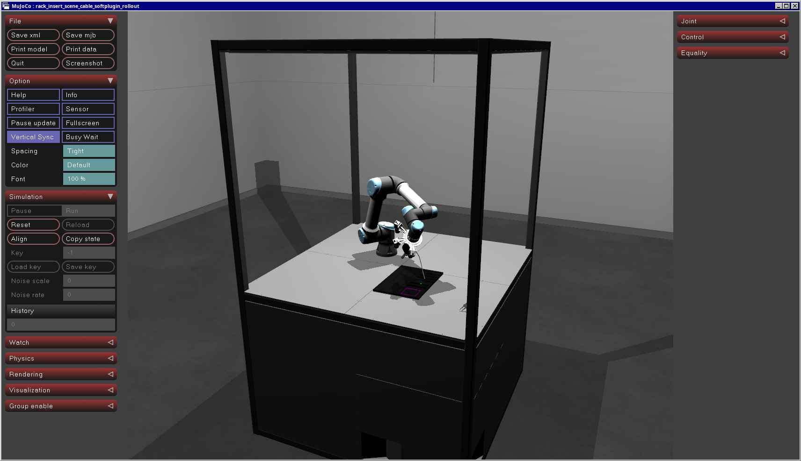
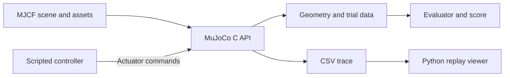
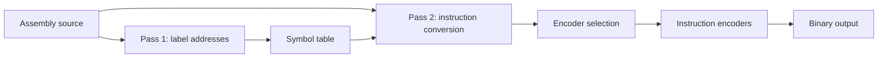

# ARMv8-RackInsert-C

This repository contains a C project from Imperial College London.
The project includes a robotics extension that uses the MuJoCo C API and ARMv8 tools.

[](FINAL_REPORT.pdf)

*RackInsert-C scene in MuJoCo, with a robot arm and a fiber-optic task board*

RackInsert-C is the robotics extension.
It uses a scripted controller to move a cable plug in the direction of the socket.
An evaluator calculates the insertion score.
The program records a CSV trace for replay.

[Final report](FINAL_REPORT.pdf) ·
[Robotics source](rack_insert_c/) ·
[Assembler source](armv8/assembler/) ·
[Interim report](docs/Interim_Report_C_Project_Group_64.pdf) ·
[Coursework specification](docs/40009_35_spec.pdf)

[Watch the RackInsert-C benchmark](https://www.youtube.com/shorts/SQgaQZX8pvA)


*Recording of RackInsert-C Benchmark: Evaluating a simple UR5e control policy restricted to 1D vertical TCP motion. Benchmark score is 0 in this case*

## Project

This is the Group 64 project for the Programming III course at Imperial College London.

| Component | Function | Location |
| --- | --- | --- |
| RackInsert-C | Robot simulation and evaluation | [`rack_insert_c/`](rack_insert_c/) |
| ARMv8 assembler | Conversion from assembly source to machine code | [`armv8/assembler/`](armv8/assembler/) |
| ARMv8 emulator | Instruction execution and machine state output | [`armv8/emulator/`](armv8/emulator/) |
| Raspberry Pi program | LED control through GPIO registers | [`programs/led_blink.s`](programs/led_blink.s) |

The ARMv8 tools use the instruction subset in the coursework specification.

### Raspberry Pi GPIO

The [GPIO program](programs/led_blink.s) controls an LED through
memory-mapped GPIO registers. It sets GPIO17 as an output.
The program uses different registers to set the output high and low.
Delay loops control the time between output changes.

[Watch the Raspberry Pi GPIO demonstration](https://www.youtube.com/shorts/EGduXmo1t-E)

*Other team members wrote the GPIO program and the ARMv8 emulator.
These components form part of the Group 64 project.*

## My Contribution

I was the primary developer of RackInsert-C.
This work included most of the code for the robotics extension:

- The simulation interface.
- The controller.
- The evaluator.
- The trace output.
- The tests.

I also wrote a large part of the ARMv8 assembler.

This repository contains the group source code and its commit history.
The contributor list gives the names of all four team members.

## Why I built RackInsert-C

I chose to build this robotic infrastructure for the C project from scratch to
close a specific gap in my robotics knowledge. Previously, I've participated in
2 major sim-to-real robotics competition (NVIDIA x Revel && Intrinsic's AIC),
this means I'm experienced in operating robotics simulation engines like 
Gazebo, NVIDIA Isaac Sim, MuJoCo using PyTorch. However, and during each 
competiton, the benchmark/evaluator infrastructure were always provided by
the hosts. This left a gap in my understanding, as I never had the opportunity
 to designing and building my own simulation environment from scratch. Because 
desining this infrastructure is a crucial part of teaching a robot via 
sim-to-real pipelines, I've hence decided to tackle this undertaking for this 
`C project`. This also gave me the excuse to dive deeply in using MuJoCo's C
API to additionally upskill.

## RackInsert-C

RackInsert-C loads a MuJoCo scene.
The scene contains:

- A UR5e robot.
- A gripper.
- A cable.
- A task board.

The benchmark program uses C17.
A Python viewer shows the recorded positions of the robot and scene objects.

### Simulation architecture



The simulation interface, controller, and evaluator are different modules.

| Module | Function |
| --- | --- |
| [`main.c`](rack_insert_c/src/main.c) | Command-line input and trial control |
| [`sim.c`](rack_insert_c/src/sim.c) | Model access and simulation state |
| [`scripted_policy.c`](rack_insert_c/src/scripted_policy.c) | Joint targets and controller states |
| [`trajectory.c`](rack_insert_c/src/trajectory.c) | Linear interpolation between joint targets |
| [`benchmark.c`](rack_insert_c/src/benchmark.c) | Trial execution and data collection |
| [`evaluator.c`](rack_insert_c/src/evaluator.c) | Insertion geometry and trial scores |
| [`logging.c`](rack_insert_c/src/logging.c) | Console output and CSV traces |
| [`replay_trace.py`](rack_insert_c/scripts/replay_trace.py) | Visual replay of recorded positions |

The simulation interface controls access to the MuJoCo model and data objects.
It also loads the necessary plugins for the default cable scene.

### Controller

The controller uses a finite-state machine with four stages.

| Stage | Target | Duration |
| --- | --- | --- |
| `APPROACH` | A position near the task board | 2.0 s |
| `HOVER` | A position above the socket | 1.0 s |
| `ALIGN` | A position for insertion | 1.0 s |
| `INSERT` | The last position of the sequence | 1.5 s |

Each stage uses specified offsets from the home position of each joint.
The controller uses linear interpolation between joint targets.
It keeps the actuator commands in the specified control range.

After the specified time, the controller changes to the next stage.
After the last stage, it changes to state `SUCCESS`.
This state identifies the end of the sequence.

The evaluator gives the insertion result independently of the controller state.

### Geometry and evaluation

The evaluator reads the positions of three MuJoCo sites:

- `plug_tip`
- `socket_mouth`
- `socket_bottom`

The evaluator calculates the socket axis from the socket mouth and socket bottom.
The evaluator uses this axis to calculate the insertion geometry.

| Quantity | Definition |
| --- | --- |
| Axial depth | Distance from the socket mouth along the socket axis to the projection of the plug tip |
| Lateral error | Distance from the plug tip to the socket axis |
| Plug-port distance | Straight-line distance from the plug tip to the socket mouth |

For full insertion, the lateral error must be 5 mm or less.
The axial depth must be at least the socket depth minus 2 mm.

The score has three levels.
The score design uses Intrinsic’s AI for Industry Challenge (AIC) as a reference.

| Level | Maximum score | Condition or data |
| --- | --- | --- |
| 1 | 1 point | The program calls the evaluator |
| 2 | 24 points | Duration, path efficiency, and smoothness, with a retry penalty |
| 3 | 75 points | Full insertion, partial insertion, or distance from the socket |

The evaluator gives points for motion quality only when the task score is more than zero.

The benchmark records the duration and path length of the plug tip.
It sets `average_jerk` to zero.
It does not calculate jerk.
It does not apply the force penalties or contact penalties in the evaluator configuration.

The team wrote this evaluator for the coursework.
These scores are not official AIC scores.

### CSV trace and replay

Each CSV trace contains:

- The simulation time.
- The controller state.
- The actuator control values.
- The generalized positions from the MuJoCo `qpos` array.
- The plug-tip coordinates.
- The lateral error.
- The axial depth.
- The plug-port distance.

The Python viewer loads the scene and applies the recorded positions.
You can use the viewer to examine the recorded trial.

The default trace file is `results.csv`.
For multiple trials, the program records a trace of only the first trial.

## RackInsert-C procedures

### Necessary software

The robotics Makefile uses Linux library files and GNU linker options.
It uses the MuJoCo shared library, `libmujoco.so`.

These tools are necessary:

- GCC with C17 support.
- GNU Make.
- Python 3 with `venv` and `pip`.
- A graphical environment for the replay viewer.

The replay window is not necessary for the benchmark executable.
The Makefile installs MuJoCo from its Python package.

### Compilation

1. Go to the repository root directory.
2. Install the dependencies:

```bash
make -C rack_insert_c deps
```

3. Compile the program:

```bash
make -C rack_insert_c all
```

The `deps` target makes a local Python environment in `.venv`.
It installs the MuJoCo package in this environment.
The Makefile gets the C headers and shared library from this package.
The `deps` target does not select a specified MuJoCo version.

### Demonstration

1. Go to the repository root directory.
2. Enter this command:

```bash
make -C rack_insert_c demo
```

The command starts one trial and writes `results.csv`.
Then, it opens the trace in the Python viewer.

### Direct commands

1. Go to the repository root directory.
2. Change to the robotics directory:

```bash
cd rack_insert_c
```

3. Select the applicable command below.

Start one trial:

```bash
./rack_insert
```

Start ten trials:

```bash
./rack_insert --trials 10
```

Select the trace file:

```bash
./rack_insert --trace results.csv
```

Open the trace in the Python viewer:

```bash
.venv/bin/python scripts/replay_trace.py \
  --trace results.csv \
  --speed 1.0
```

To use a different compatible MJCF scene:

1. Select the scene with the benchmark option `--scene`.
2. Select the same scene with the replay option `--scene`.

The default scene file is:

```text
assets/mujoco/rack_insert/rack_insert_scene_cable_softplugin_rollout.xml
```

The console output gives the number of completed sequences and the mean score.
The value `completed_trials` counts completed controller sequences.
It does not count full insertions.

## ARMv8 assembler

The assembler converts the specified AArch64 instruction subset into 32-bit instruction words.

### Two-pass design

The assembler reads the source file two times.
The first pass records labels and their instruction addresses in a symbol table.
The second pass uses these addresses to convert the instructions into machine code.



The assembler uses a dispatch table to select an encoder for each mnemonic.
Different encoder files process the instruction groups.

The assembler includes:

- A symbol table that increases in size when necessary.
- Functions that read registers and immediate operands.
- Label resolution for branches and literal loads.
- Instruction aliases.
- Functions that set the bit fields of each instruction.
- A command-line interface for binary output.

### Instruction subset

| Group | Instructions or operand types |
| --- | --- |
| Arithmetic | `add`, `adds`, `sub`, `subs`; immediate and register operands |
| Arithmetic aliases | `cmp`, `cmn`, `neg`, `negs` |
| Logical operations | `and`, `bic`, `eor`, `eon`, `orr`, `orn`, `ands`, `bics` |
| Logical aliases | `tst`, `mov`, `mvn` |
| Wide moves | `movn`, `movz`, `movk` |
| Multiply | `madd`, `msub`, `mul`, `mneg` |
| Data transfer | `ldr`, `str`; literal addresses and register-based addresses |
| Branches | `b`, `br`, and the specified conditional branches |
| Data directive | `.int` |

The load/store encoder converts these address forms into instruction bits:

- Unsigned immediate offsets.
- Register offsets.
- Pre-index forms.
- Post-index forms.
- Literal addresses for `ldr`.

The instruction subset includes 32-bit and 64-bit register forms.

### Source files

| File | Function |
| --- | --- |
| [`assemble.c`](armv8/assembler/assemble.c) | Command-line entry point |
| [`assemble_file.c`](armv8/assembler/assemble_file.c) | Two-pass file input and encoder selection |
| [`symbol_table.c`](armv8/assembler/symbol_table.c) | Label storage and address lookup |
| [`ass_helpers.c`](armv8/assembler/ass_helpers.c) | Operand functions |
| [`ass_immreg.c`](armv8/assembler/ass_immreg.c) | Selection of immediate or register arithmetic |
| [`ass_branch.c`](armv8/assembler/ass_branch.c) | Branch instructions and relative offsets |
| [`ass_single_data_transfer.c`](armv8/assembler/ass_single_data_transfer.c) | Load/store instructions |
| [`dotint.c`](armv8/assembler/dotint.c) | Integer data directive |

Other encoder files process:

- Arithmetic instructions.
- Logical instructions.
- Multiply instructions.
- Wide-move instructions.

## ARMv8 emulator and Raspberry Pi program

The emulator executes the coursework instruction subset.
It simulates:

- General-purpose registers.
- A program counter.
- Condition flags.
- 2 MiB of memory.

The fetch–decode–execute loop selects a handler for each instruction.
The output includes register values and memory words that are not zero.

The Raspberry Pi program controls an LED through GPIO registers.
It sets GPIO17 as an output.
A delay loop controls the time between output changes.

These components are part of the group submission.

## ARMv8 procedures

### Compilation

1. Go to the repository root directory.
2. Compile the assembler and emulator:

```bash
make -C armv8
```

The Makefile makes these executables:

- `armv8/assemble`
- `armv8/emulate`

### Assembly and emulation

1. Go to the repository root directory.
2. Make a file with the name `example.s`.
3. Put this assembly source in the file:

```asm
movz x0, #42
and x0, x0, x0
```

4. Convert the source file into machine code:

```bash
./armv8/assemble example.s example.bin
```

5. Execute the binary file with the emulator:

```bash
./armv8/emulate example.bin
```

The first instruction puts `42` in register `x0`.
The last instruction stops the coursework emulator.

To write the emulator output to a file, use:

```bash
./armv8/emulate example.bin example.out
```

The assembler writes instruction words in the byte order of the host.
A little-endian host is necessary for the coursework binary format.

### Raspberry Pi binary

1. Go to the repository root directory.
2. Convert the LED program into a binary file:

```bash
./armv8/assemble programs/led_blink.s kernel8.img
```

The GPIO program uses the Raspberry Pi hardware in the coursework specification.
The emulator does not simulate the GPIO peripherals.

## Tests

### RackInsert-C tests

1. Go to the repository root directory.
2. Do the tests:

```bash
make -C rack_insert_c test
```

| Test | Function |
| --- | --- |
| `test_evaluator` | Checks of axial depth, lateral error, and the full-insertion score |
| `test_actuators` | Actuator lookup and joint movement |
| `test_scripted_policy` | Sequence completion and plug-tip movement before the timeout |

For the actuator test, at least one actuator must cause joint movement above the specified threshold.

For the policy test, the controller must complete the sequence before the timeout.
The plug tip must also move.
The policy test does not examine insertion success.

### ARMv8 coursework tests

The Imperial test suite is external to this repository.
It uses the assembler and emulator executables as test inputs.

A previous coursework test record shows 592 correct emulator results out of 592.
This record gives the results of that test execution.

### Sanitizer compilation

The Makefiles have targets for AddressSanitizer and UndefinedBehaviorSanitizer.

1. Go to the repository root directory.
2. Compile the ARMv8 tools with the sanitizers:

```bash
make -C armv8 asan
```

3. Compile the robotics program with the sanitizers:

```bash
make -C rack_insert_c asan
```

## Design and limits

The simulation interface controls access to MuJoCo.
The controller and evaluator use different modules.
The controller can change without changes to the geometry calculations.

The scripted controller gives a basic motion sequence for the benchmark.
The project includes the software necessary for robotics trials and their evaluation.

The implementation has these limits:

- The controller uses specified joint-space waypoints.
- The controller has no Cartesian inverse-kinematics solver.
- The controller has no learned policy.
- The insertion check uses the plug-tip position and socket axis.
- The evaluator does not examine plug orientation or mechanical latching.
- The scene does not simulate all cable and contact effects.
- The benchmark does not calculate jerk.
- All trials use the same scene and scripted controller.

The final report contains more information about the design and project work.

## Repository structure

```text
ARMv8-RackInsert-C/
├── README.md
├── FINAL_REPORT.pdf
├── LICENSE
├── armv8/
│   ├── Makefile
│   ├── assembler/
│   ├── emulator/
│   └── bit_manipulation.h
├── programs/
│   └── led_blink.s
├── rack_insert_c/
│   ├── Makefile
│   ├── README.md
│   ├── assets/
│   │   └── mujoco/
│   │       └── rack_insert/
│   ├── include/
│   ├── src/
│   ├── tests/
│   ├── scenes/
│   └── scripts/
│       └── replay_trace.py
└── docs/
    ├── 40009_35_spec.pdf
    ├── Interim_Report_C_Project_Group_64.pdf
    └── report_sources/
        ├── Makefile
        ├── Report.tex
        ├── Checkpoint.tex
        ├── mujoco-c.png
        └── Emulator-Dependencies.png
```

## Reports

- [Final report](FINAL_REPORT.pdf): design and project results.
- [Interim report](docs/Interim_Report_C_Project_Group_64.pdf): the project at the interim checkpoint.
- [Coursework specification](docs/40009_35_spec.pdf): requirements and the instruction subset.
- [Report sources](docs/report_sources/): LaTeX files and report figures.

The final report link and the image near the top open the PDF.

## Contributors and acknowledgments

Group 64:

- Rahul Babu
- Rayan Abdallah
- Ryan Wong
- Shi Hao Ng

The repository contains the commit history of the group project.

Imperial College London supplied the coursework specification and test infrastructure.

The RackInsert-C scene uses assets from
[Intrinsic’s AI for Industry Challenge](https://github.com/intrinsic-dev/aic).
The AIC score structure was a reference for the evaluator design.

[MuJoCo](https://github.com/google-deepmind/mujoco) supplies the physics engine and C API.

## License

The [LICENSE](LICENSE) file contains the repository license.

The licenses and notices of the source projects apply to third-party software and scene assets.
